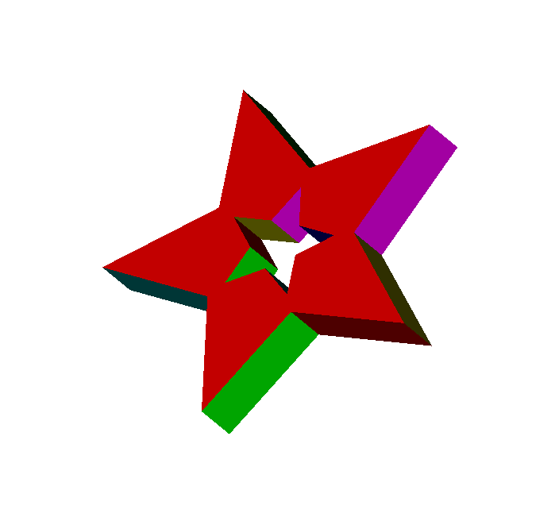

# B-rep程序

## 实现功能

### 内部接口

* 半边数据结构
* 五个欧拉操作
  * mvfs
  * mev
  * mef
  * kemr
  * kfmrh

### 用户接口

* createFace：创建一个底面
* addRing：向底面增加一个内环
* sweep：进行平移sweep操作

### 附加功能

* 支持读取数据文件渲染B-rep模型
* 支持导出当前渲染结果至bmp格式的图片

## 使用说明

### 渲染B-rep结构

1. 打开程序
2. 点击**菜单栏**的**读取文件**按钮选择数据文件进行渲染
3. 按**A**，**D**控制模型绕y轴旋转，按**W**，**S**建控制模型绕x轴旋转
4. 点击**菜单栏**的**保存**按钮将当前渲染结果导出为bmp格式图片

### 数据文件格式

#### face指令

##### 功能

* 创建一个底面

#### 格式

```face x0,y0,z0 x1,y1,z1 ...```

按照顺时针或逆时针顺序给定平面的各点坐标

#### ring指令

##### 功能

* 向底面添加一个内环

#### 格式

```ring x0,y0,z0 x1,y1,z1 ...```

按照顺时针或逆时针顺序给定内环的各点坐标

#### sweep指令

##### 功能

* 进行平移sweep操作

#### 格式

```sweep x,y,z d```

其中x,y,z为方向向量

d为长度

## 结果展示

### 多个内环


### 斜向sweep


### 复杂多边形



